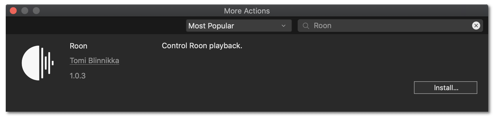
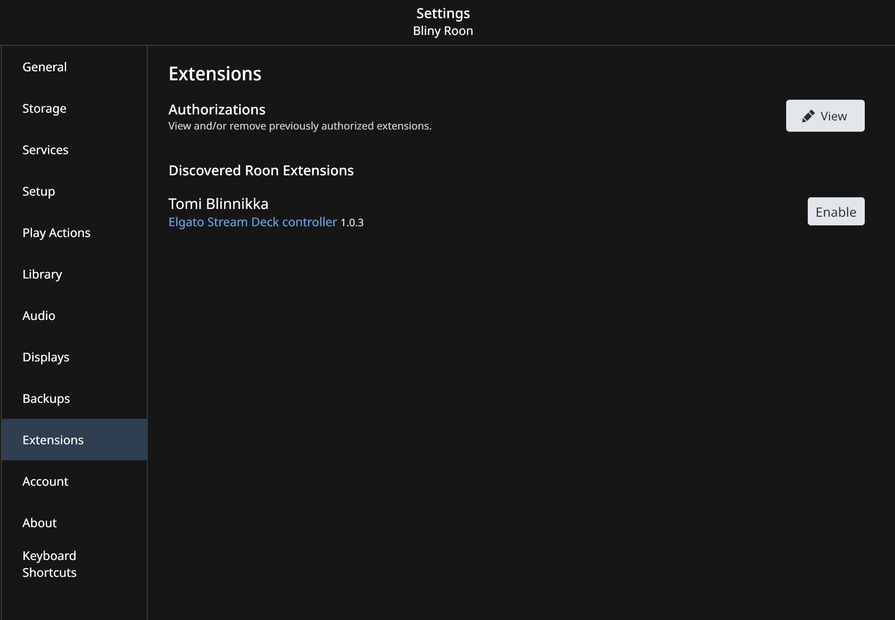

# Roon playback control for Elgato Stream Deck
This is a plug-in that allows controlling music playback of Roon outputs with the Elgato Stream Deck.

## Features
The plug-in supports most basic playback actions. Note that some actions are available in two flavors. For example, there is a Play/Pause action in addition to separate Play and Pause actions. "Why?" you might ask. Well, if you're streaming there are many cases where you want to make sure you only pause or only play music. A great use case is in multi-actions where you want to "script" multiple things to happen. The Play/Pause action might actually stop playback (if already playing) instead of starting it.

- Play/Pause
  - Cover art (optional)
  - Elapsed playback time (optional)
- Play
- Pause
- Stop (may pause instead)
- Play playlist, tags, artist, album
- Play related artist/album
- Previous
- Next
- Loop mode (all/one/off)
- Shuffle mode (on/off)
- Volume up
- Volume down
- Volume set
- Mute/Unmute
- Roon radio on/off

## Installation
There are three basic steps required to get started with the plug-in:
1. Install the Stream Deck plug-in.
2. Configure your Roon Core address.
3. Enable the plug-in extension in Roon.

### Step 1: Stream Deck plug-in installation
Install the plug-in from the Stream Deck store. Just click on **More Actions..**, type in `Roon` in the search box, and then click the **Install** button. See below.

### Step 2: Roon Core configuration
- Once the plug-in is installed, scroll down in the list until you find the `Roon` category.
- Add one of the Roon actions, such as Play/Pause, to the Deck.
- You'll see the Roon core section in the button configuration. This is only expanded when you haven't configured the address of your Roon Core, but you can alway get back to it by clicking on the expansion triangle.
- Enter the hostname (or IP address) and port of your Roon Core (the port is likely to be 9100), and then click **Connect**.

At this point, assuming the address is correct and your computer is able to reach the Roon Core, you'll need to enable the extension in Roon.

> Tip: You only need to configure the Roon Core once. While the connection options show up for each button, the settings under this section are shared across all buttons.

### Step 3: Enable Roon extension
- Open Roon.
- Open the main menu, and select **Settings**.
- In the _Settings_ window, select **Extensions** and find the the **Elgato Stream Deck controller** extension.
- Click **Enable**.

> _Tip:_ You know you've entered the address and port correctly in Stream Deck once you see the button in Roon prompting you to enable the extension. If the extension doesn't show up, check the address you entered in Stream Deck, or try using your Roon Core's IP address, and click **Connect** again.

## Configure buttons
Once you've got the Roon Core configured and the extension enabled in Roon, you can start adding buttons and customizing them. You'll need to specify which Roon output each button should target. You can either type in the name of the zone/output, or you can select an active output from the _Available outputs_ dropdown. Only outputs active and connected to Roon will show up, but you can type in the name of inactive outputs at any time.

> NOTE: If you have multiple outputs with the same name, the first one active at that point in time will be used. It is highly recommended to rename any duplicate outputs to be unique or your buttons may not control the output you intend!

### Settings
All actions have the option to _Dim when action not available_. This will cause the default button images to be dimmed slightly if that action is not available or Roon cannot be reached. Note, however, that this feature will not work if you customize the images for the button.

When you add a new button, it will be prepopulated with the previously selected output name. However, each button can target a different output. This means you can have one button control the music in the living room and another adjusting the kitchen.

## Limitations
Only a single Roon Core can be used.

## Misc
Roon is (probably) a trademark or registered trademark of Roon Labs LLC.

Elgato, Corsair, and Stream Deck are (probably) trademarks or registered trademarks of Corsair GmbH

Regardless, any trademarks, logos, and such are the property of their respective owners, so all you lawyers should focus on more important things.

